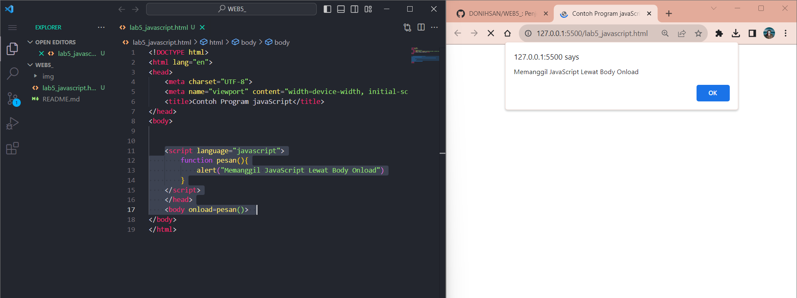

# Tugas Praktikum { Pertemuan ke 6 } 

|**Nama**|**NIM**|**Kelas**|**Matkul**|
|----|---|-----|------|
|Muhammad Ikhsan Fakhrudin|312210019|TI.22.A.2|Pemrograman WEB|

# JavaScript Dasar

## Langkah-langkah Praktikum

Membuka ``text editor`` , di sini saya menggunakan ***Visual Studio Code.***

## JavaScript Dasar

***Pemakaian Alert Sebagai Property Window :***

***Pemakaian Method dalam Objek :***

***Pemakaian Prompt :*** 

***Pembuatan Fungsi dan Cara Pemanggilannya :***

## Dasar Pemrograman JavaScript

***Operasi Dasar Aritmatika :***

***Seleksi Kondisi ( if-else) :***

***Penggunaan Operator Switch Untuk Seleksi Kondisi :***

## Pembuatan Form

***Form Input :***

***Form Button :***

## HTML DOM

Pilihan Menggunakan ``Checkbox`` dengan Perhitungan Otomatis.

## Pertanyaan dan Tugas

Buatlah Script Untuk Melakukan Validasi Pada Isian Form.

## Jawab

Saya Membuat Validasi Berupa : ***Nama , No.Tlp dan E-mail.***

## Nama

Disini saya akan memberikan validasi berupa inputan hanya boleh menggunakan Huruf/Alphabet saja. Contoh : **Ikhsan Fakhrudin** ``(benar)``, **Ikhsan Fakhrudin99** ``(salah).``

***Penjelasan :***

- Membuat nama function Alphabet, dengan parameter dinamis yaitu (nilai,pesan).

- Data yang boleh dimasukkan adalah berupa "a-zA-Z".

- Jika selain data "a-zA-Z" ini dimasukkan, maka akan muncul pesan Alert "alert(pesan);"

## No.Tlp

Pada bagian ini akan saya berikan validasi berupa hanya angka saja yang boleh di inputkan, contoh: ``12345 (benar)``, ``123AB (salah).``

***Penjelasan :***

- var numberExp = /^[0-9]+$/; merupakan variabel numberExp yang diberi batasan validasi angka 0-9.

- Arti Match pada "if(nilai.value.match(numberExp))" adalah string.match(), mencari string menggunakan Regular Expression (Regex).

- Jika salah atau inputan tidak benar maka akan ada pesan alert "alert(pesan);"

## E-mail

Pada email akan diberikan validasi masih berupa Regular Expression. Contoh : ``ihsaanef@gmail.com (benar)``, ``Donihsan98@gmail. (salah)``.

***Penjelasan :***

- Membuat variabel email " var email = /^([a-zA-Z0-9_.+-])+@(([a-zA-Z0-9-])+.)+([a-zA-Z0-9]{2,4})+$/; " berupa huruf, angka dan simbol yang diperbolehkan dalam input sebuah email. Jika email salah maka akan ada pesan alert "alert(pesan);"

## Berikut Penulisan Form yang Benar

## SELESAI  
